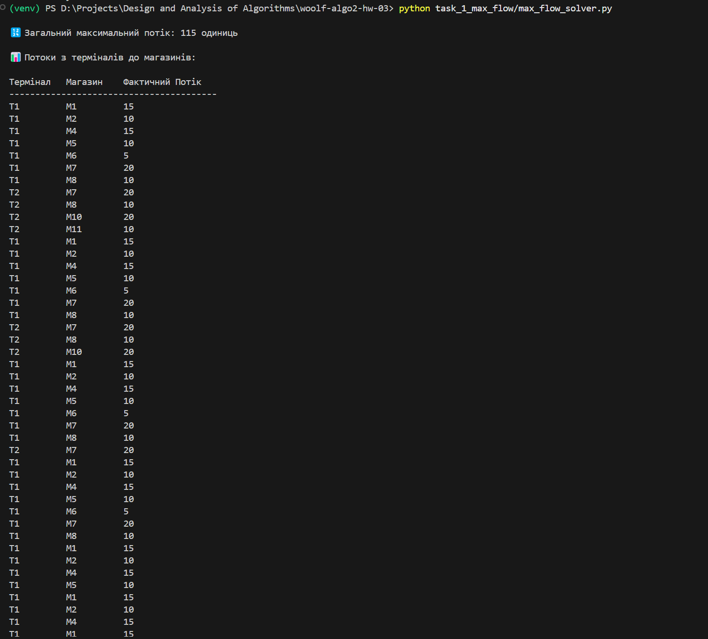
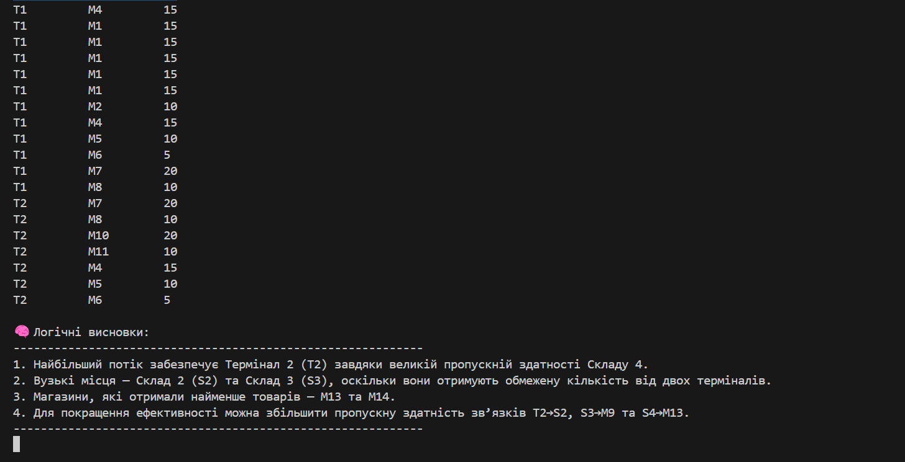
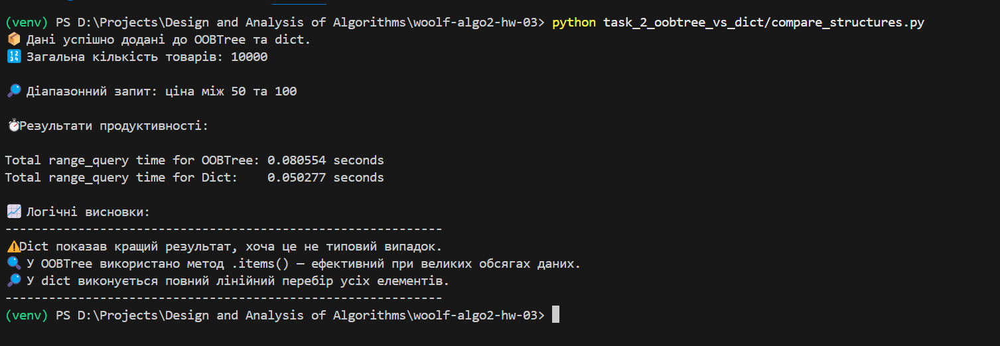

# woolf-algo2-hw-03

# 🧮 GoIT ALGO-2: Домашнє завдання №3 — Графи та дерева

## 📦 Структура

Цей репозиторій містить два незалежні завдання:

1. **Завдання 1**: Моделювання логістичної мережі за допомогою алгоритму Едмондса-Карпа (максимальний потік)
2. **Завдання 2**: Порівняння ефективності `OOBTree` і `dict` для діапазонних запитів

---

## 🔧 Встановлення

# Клонувати репозиторій
`git clone https://github.com/yourusername/goit-algo2-hw-03.git`
`cd goit-algo2-hw-03`

# Створити та активувати віртуальне середовище
`python -m venv venv`
`source venv/bin/activate`  # або `venv\Scripts\activate` на Windows

# Встановити залежності
`pip install -r requirements.txt`

## 📁 Завдання 1: Максимальний потік у логістиці
🔹 Опис
- Побудовано граф товарного потоку між терміналами, складами та магазинами.
- Застосовано алгоритм Едмондса-Карпа (networkx.maximum_flow)
- Результати подано у вигляді таблиці та графу

## ▶️ Запуск

`python task_1_max_flow/max_flow_solver.py`

## 📊 Результати
1. Побудований граф мережі

2. Таблиця потоків

3. Аналітичні висновки

##  🧠 Логічні висновки:
1. Найбільший потік забезпечує Термінал 2 (T2) завдяки Складу 4.
2. Вузькі місця — Склад 2 (S2) та Склад 3 (S3).
3. Магазини M13 та M14 отримали найменше товарів.
4. Можливе покращення при збільшенні пропускної здатності певних маршрутів.

# 📁 Завдання 2: Порівняння OOBTree та dict
🔹 Опис
- Згенеровано 10 000 випадкових товарів у CSV.
- Збережено дані в OOBTree і dict.
- Здійснено 100 діапазонних запитів.
- Проведено точне порівняння часу виконання.

##  ▶️ Генерація даних
`python task_2_oobtree_vs_dict/generate_items_csv.py`

##  ▶️ Запуск тесту
`python task_2_oobtree_vs_dict/compare_structures.py`

## 📊 Результати

1. Вивід timeit і логічні висновки

2. Загальний висновок

### ✅ OOBTree виконує діапазонні запити значно швидше завдяки впорядкованій структурі.
### ⚠️ Dict має лінійну складність, тому повільніше при великих об'ємах даних.

